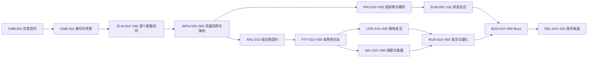

# ElementWar 开发路线

- 状态：Active
- 维护日期：2026-08-20
- 路线维护任务：`DOC-001`

本文是开发顺序、任务状态、直接依赖、当前唯一下一项和版本裁剪边界的唯一维护来源。设计目标以 [`GameDesign.md`](GameDesign.md) 及其细则为准，当前代码边界以 [`Architecture.md`](Architecture.md) 为准，单次获批范围与证据以对应 Feature Spec 为准。

## 如何使用

- 新对话只需发送 `继续下一阶段`。Codex 应从下方“当前唯一下一项”进入，只读核对实时仓库，然后一次性汇总仍需确认的高影响问题。
- 也可以发送 `开始功能：<任务 ID 或名称>`。Codex 必须先核对依赖；不能因为指定了远期功能就静默跳过前置契约。
- 路线任务不是实施授权。大型任务仍按 [`Workflow.md`](Workflow.md) 建立 Feature Spec、完成澄清并等待明确授权。
- 任务组织按风险自适应：一个任务可以完成局部闭环；公共契约、序列化迁移、状态所有权或发布候选可拆成设计、实施和独立审查。

## 状态定义

| 状态 | 含义 |
|---|---|
| `Done` | 已有实现与可定位证据；证据等级在任务中明确，不自动等于 Accepted |
| `Next` | 当前主线唯一应进入的原子任务 |
| `Ready` | 直接依赖已满足，可在明确点名时开始，但不是当前主线优先项 |
| `Planned` | 顺序与行为边界已知，仍有未完成依赖 |
| `Blocked` | 依赖外部资产、授权或尚未解决的高影响决策 |
| `Deferred` | 首版明确不实施，避免隐性扩大范围 |

## 当前唯一下一项

**ELM-030 — 反应判定、消耗与归因管线。** 详见 [`Roadmap/01-CombatElementsWeapons.md`](Roadmap/01-CombatElementsWeapons.md#elm-030-反应判定消耗与归因管线)。

选择它是因为 `ELM-020` 已建立单槽附着、最近来源刷新、版本化消费和生命周期清理；异元素请求现在会原子返回既有附着与触发请求，但尚无元素对查表、反应归因、同一攻击限制或递归防护。先关闭通用反应事务，`WPN-010` 的生产来源和 `ELM-040` 的超载输出才能依赖稳定结果。

当前已完成基线：

- `DOC-001`：短指令、自适应工作流与详细路线文档（本次文档切片；以本文件收口记录为准）。
- `CMB-001`：Combat Domain Contract v1，Fast Verified 且额外完成 PlayMode；Windows64 与主线人工验收未运行。证据见 [`CombatDomainContractV1.md`](Features/CombatDomainContractV1.md)。
- `CMB-010`：战斗目标、阵营与攻击执行身份 v1，Fast Verified 且额外完成 PlayMode 与 Bootstrap 序列化扫描；Windows64 与主线人工验收未运行。证据见 [`CombatantFactionExecutionIdentityV1.md`](Features/CombatantFactionExecutionIdentityV1.md)。
- `ELM-010`：元素施加配置、来源身份与请求快照 v1，Fast Verified 且额外完成 PlayMode 与真实 Profile/Registry 加载；Windows64 与主线人工验收未运行。证据见 [`ElementApplicationProfileSnapshotV1.md`](Features/ElementApplicationProfileSnapshotV1.md)。
- `ELM-020`：敌方元素附着运行时与生命周期 v1，Fast Verified 且额外完成 PlayMode 与 Bootstrap 序列化/Missing Script 检查；Windows64、性能与主线人工验收未运行。证据见 [`ElementAttachmentRuntimeLifecycleV1.md`](Features/ElementAttachmentRuntimeLifecycleV1.md)。
- `VER-001` / `VER-002` / `VER-003`：EditMode、PlayMode、Bootstrap-only Windows64 自动化基线已分别关闭；它们不是完整项目验收。详见 [`Roadmap/04-IntegrationRelease.md`](Roadmap/04-IntegrationRelease.md)。

## 主依赖图

输入、许可、验证、敌人特征测试、性能和旧架构收敛是穿插门禁，不应等到主链末尾才首次处理。

## 分域路线

| 文档 | 覆盖范围 | 关键重构落点 |
|---|---|---|
| [`01-CombatElementsWeapons.md`](Roadmap/01-CombatElementsWeapons.md) | 战斗身份、附着/反应、超载、武器、弹药、投射物和六种反应 | 伤害上下文、目标去重、`WeaponRuntime` 职责、装填事务、对象池重置 |
| [`02-CharactersPartySkills.md`](Roadmap/02-CharactersPartySkills.md) | 输入、闪避、双角色、AI 队友、切换、倒地复活、技能和 HUD | Party 所有权、输入来源、相机/HUD 绑定、技能与 Modifier 运行时 |
| [`03-EnemiesRunBoss.md`](Roadmap/03-EnemiesRunBoss.md) | 敌人加固、关卡、波次、强化、失败重开和 Boss | 先特征测试后决定修补或重写；Run/Stage 唯一状态机与完整重置 |
| [`04-IntegrationRelease.md`](Roadmap/04-IntegrationRelease.md) | 资产许可、组合根、旧架构、验证、性能、构建与发布 | 全局入口收敛、Legacy/Lua/旧场景迁移、验证入口统一 |

## 既有代码重构归属

| 已知问题 | 处理任务 | 进入时机与边界 |
|---|---|---|
| 范围效果仍缺统一目标集合、稳定排序、遮挡与数量策略 | `CMB-020` | `CMB-010` 已提供 Combatant、阵营和单目标去重；在首个范围反应或投射物爆炸前完成通用查询 |
| `WeaponRuntime` 职责过多，动画事件与运行时结算边界不稳 | `WPN-020` | 首个超载闭环先证明需求，再于多武器/多弹药前用特征测试保护重构 |
| 旧 Input Action 与新主线意图混杂 | `INP-010` | 在闪避、换枪、换元素、切人、投掷和复活输入扩展前增量迁移 |
| 相机、HUD、输入和角色状态按单角色绑定 | `ARC-010`、`PTY-010`、`PTY-020` | 在第二角色切换前建立组合根和 Party 唯一所有权，不事后同步多个 ActiveCharacter |
| 现有敌人代码质量与攻击行为存在疑问 | `ENM-010`～`ENM-040` | 先复现和建立特征测试，再以证据决定局部修补或边界重构，不预设整套重写 |
| Skill/Buff/AreaEffect/Stage/Reaction 配置多为壳或无消费者 | `ELM-010`、`MOD-010`、`SKL-010`、`RUN-020`、`CFG-010` | 由首个真实消费者反推最小契约，最后统一删除或冻结无消费者字段 |
| 静态 `Active`/`Instance`、全局查找与生命周期隐式 | `ARC-010`、`ARC-020` | 先固定组合根，再随 Party/Run 等消费者分批迁移，避免仓库级一次性替换 |
| Legacy C#、Lua 元素链、SampleScene、旧 WeaponView 与主线并存 | `LEG-010`、`LEG-020` | 新主线闭环稳定后做引用审计和可恢复序列化迁移，不边开发边扩展两套实现 |

## 首版裁剪规则

路线按完整设计拆解，但首个可发布演示必须保住“可解释的闭环”，不按代码数量平均裁剪：

- `Must`：确定性战斗、至少一个完整元素反应、双角色切换、队友跟随、倒地/失败、可完成的一轮战斗流程、一个 Boss 核心阶段、Windows64 可运行版本和许可清单。
- `Should`：六种反应、两套完整技能、九个强化、多个敌人变体、Boss 多阶段、完整反馈与设置。
- `Deferred`：联网实现、跨平台矩阵、无消费者的通用框架、为旧 Lua 与新 C# 同时新增功能。

若时间或资产风险迫使裁剪，先在相关任务中缩小内容数量，保留状态闭环、错误恢复和验证；不得把未完成的共享契约伪装为“以后再补”。

## 路线维护规则

1. 全部路线文件中只能有一个任务带有 `Next` 状态标记。
2. 完成任务时记录 Feature Spec、实际证据等级和剩余风险，再把所有已满足依赖的任务更新为 `Ready` 或选出新的唯一下一项。
3. 路线只写顺序、缺口、原子结果、依赖和证据边界；具体数值与完整玩法规则链接到设计文档，不复制维护。
4. 仓库事实与路线冲突时先修正路线；改变顺序必须写明依赖、风险或版本裁剪理由。
5. 远期任务开始前必须重新审计实时实现。远期“实施要点”是约束和检查表，不是对尚未检查代码的断言。

## DOC-001 收口记录

- 状态：Done（文档与依赖校验通过；未运行 Unity 验证）
- 行为：建立短指令入口、风险自适应任务组织、四份详细路线和重构归属；未修改运行时代码或 Unity 序列化资源。
- 验证：75 个相对 Markdown 链接目标存在；89 个任务 ID 可解析，88 个开发任务依赖全部存在且无环；唯一下一项为 `CMB-010`；全部长期文档少于 300 个非空行；空白与 scoped diff 检查通过。
- ADR：不需要；本任务没有改变程序集、状态所有权、公共运行时契约或场景组合根。
- 后续解锁：`CMB-010`。
