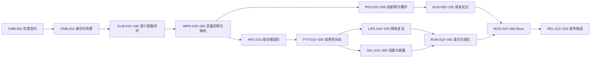

# ElementWar 开发路线

- 状态：Active
- 维护日期：2026-08-30

本页只维护唯一 `Next`、状态定义、依赖骨架和分域导航。完成基线、重构归属和版本裁剪见 `Roadmap/Reference.md`，正常“继续下一阶段”不读取该参考页。

## 使用规则

- `继续下一阶段`：只读取下面“当前唯一下一项”，再读取对应路线文件中的**该任务块**；不要全文加载路线文件。
- `开始功能：<任务 ID 或名称>`：读取指定任务块并核对直接依赖。
- 路线任务描述的是开发顺序和边界，不自动把普通任务升级为 Full；实施等级按根 `AGENTS.md` / Skill 判断。
- 全部路线始终只有一个 `Next`。

## 当前唯一下一项

**WPN-020 — WeaponRuntime 职责与开火时序重构。**

任务块：`Roadmap/01-CombatElementsWeapons.md`

原因：`ELM-040` 已完成首个“开火 → 附着 → Overload → 范围伤害/控制 → 反馈”闭环；在扩展多武器实例和弹药前，先收敛当前步枪职责与开火时序，避免重复动画事件造成重复开火或结算。

## 状态定义

| 状态       | 含义                                   |
| ---------- | -------------------------------------- |
| `Done`     | 已有实现与可定位证据；验证状态单独记录 |
| `Next`     | 当前主线唯一下一项                     |
| `Ready`    | 直接依赖满足，可明确点名开始           |
| `Planned`  | 顺序已知，仍有依赖                     |
| `Blocked`  | 等待外部资产/授权/高影响决策           |
| `Deferred` | 首版明确不实施                         |

## 主依赖图

## 分域路线

- `Roadmap/01-CombatElementsWeapons.md`：战斗、元素、武器、弹药、投射物。
- `Roadmap/02-CharactersPartySkills.md`：输入、角色、Party、生命、技能、HUD。
- `Roadmap/03-EnemiesRunBoss.md`：敌人、关卡、Run、Boss。
- `Roadmap/04-IntegrationRelease.md`：许可、组合根、Legacy、验证、性能、发布。

## 维护

完成任务时记录实际证据，更新依赖满足项，并选出新的唯一 `Next`。路线只写顺序、目标、可观察结果、明确非目标和依赖；Planned 不预定实现形状，完整玩法规则链接 Design，最终证据链接 Feature/验证记录。
